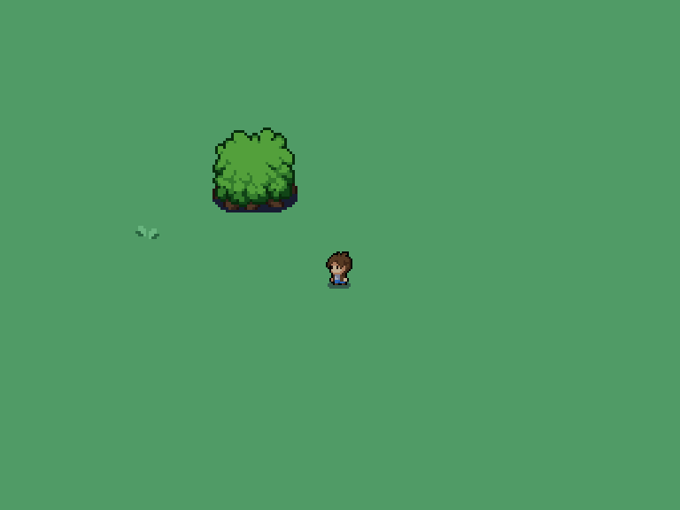

# JavaGame

A 2D tile-based adventure game built from scratch in Java as a learning project. This game features a top-down perspective with tile-based rendering, player movement, collision detection, and interactive game objects.



## 🎮 About the Game

This is a 2D role-playing game prototype where you control a character exploring a grass-themed world. The game features:

- **Tile-based rendering system** - The world is built from a grid of tiles
- **Player character** with animated sprites for different directions
- **Collision detection** - Interact with the environment and obstacles
- **Interactive objects** - Keys, chests, doors, and boots
- **Camera system** - The world scrolls as the player moves
- **Attack animations** - Combat system foundations

## 🕹️ Controls

- **W/A/S/D** - Move the character (Up/Left/Down/Right)
- **R** - Perform attack animation
- The game also includes mouse input handling for future features

## 🖼️ Screenshots

### Gameplay
The game features a character exploring a procedurally placed grass environment with trees and other environmental elements.


## 🛠️ Technical Details

### Architecture

The game follows an object-oriented architecture with distinct separation of concerns:

- **Main Package** - Game loop, window management, and core systems
- **Entity Package** - Player and entity logic
- **Environment Package** - Environmental objects and decorations
- **TexturesTiles Package** - Tile management and rendering
- **Object Package** - Interactive game objects

### Game Settings

- **Resolution**: 768x576 pixels (8x6 tiles on screen)
- **Tile Size**: 96 pixels (16px base × 6 scale factor)
- **World Size**: 50×50 tiles
- **Frame Rate**: 30 FPS
- **Player Speed**: 4 pixels per frame

### Map System

The game uses a text-based map system (`map01.txt`) where each number represents a different tile type, making it easy to design and modify levels.

## 📚 What I Learned

Through building this game, I gained hands-on experience with several important Java concepts and libraries:

### Core Java Concepts

1. **Object-Oriented Programming**
   - Class inheritance and polymorphism (Entity base class extended by Player)
   - Encapsulation and access modifiers
   - Interface implementation (Runnable for game loop)

2. **Event-Driven Programming**
   - KeyListener for keyboard input
   - MouseListener for mouse events
   - Event handling and user input processing

3. **Multi-threading**
   - Game loop implementation using Thread
   - Understanding the game update/render cycle
   - FPS management and timing

### Java Libraries & APIs

4. **Java AWT (Abstract Window Toolkit)**
   - `Graphics2D` - Advanced 2D graphics rendering
   - `Rectangle` - Collision boxes and hit detection
   - `Color` - Color management
   - `Dimension` - Component sizing
   - `BufferedImage` - Image handling and manipulation
   - `Robot` - Screen capture capabilities

5. **Java Swing**
   - `JFrame` - Window creation and management
   - `JPanel` - Custom drawing surface
   - Understanding the component hierarchy

6. **Java I/O**
   - `IOException` - Exception handling for file operations
   - `BufferedReader` - Efficient file reading for map data
   - `InputStream` - Resource loading from JAR files

7. **Java ImageIO**
   - `ImageIO` - Loading PNG sprite images
   - Resource path management for embedded assets

### Game Development Concepts

8. **Tile-Based Rendering**
   - Efficient world representation using tiles
   - Camera/viewport management
   - Coordinate system translation (world vs. screen coordinates)

9. **Collision Detection**
   - AABB (Axis-Aligned Bounding Box) collision
   - Solid area calculations
   - Predictive collision checking

10. **Sprite Animation**
    - Frame-based animation systems
    - Sprite sheet management
    - Animation state machines

11. **Game Architecture Patterns**
    - Game loop pattern
    - Entity-component organization
    - Asset management
    - Separation of rendering and game logic

### Problem-Solving Skills

12. **Resource Management**
    - Loading and organizing game assets
    - Memory-efficient sprite storage
    - File path handling in Java projects

13. **Performance Optimization**
    - Frame rate control
    - Efficient rendering (only drawing visible tiles)
    - Minimizing object creation in the game loop

14. **Debugging Graphics Applications**
    - Visual debugging techniques
    - Console output for state tracking
    - Understanding the AWT/Swing painting system

## 🚀 How to Build and Run

### Prerequisites

- Java Development Kit (JDK) 8 or higher
- Any Java-compatible IDE (optional) or command line

### Compilation

```bash
# Navigate to the project directory
cd JavaGame

# Compile all Java files
javac -d bin -sourcepath src src/Main/Main.java

# Run the game
java -cp bin:src Main.Main
```

### Running from an IDE

1. Open the project in your IDE (Eclipse, IntelliJ IDEA, NetBeans, etc.)
2. Set the source folder to `src`
3. Run `Main.Main` class
4. The game window should appear

## 📂 Project Structure

```
JavaGame/
├── src/
│   ├── Main/           # Core game systems
│   │   ├── Main.java
│   │   ├── MainPannel.java
│   │   ├── KeyHandler.java
│   │   ├── MouseHandler.java
│   │   ├── CollisionChecker.java
│   │   └── Asset.java
│   ├── Entity/         # Game entities
│   │   ├── Entity.java
│   │   └── Player.java
│   ├── Environment/    # Environmental objects
│   ├── TexturesTiles/  # Tile system
│   │   ├── Tiles.java
│   │   └── TileManager.java
│   ├── object/         # Interactive objects
│   ├── sprites/        # Game graphics
│   ├── maps/           # Level data
│   └── icon_main/      # Application icon
├── screenshots/        # Documentation images
└── README.md
```

## 🔮 Future Improvements

- Add NPC characters with AI
- Implement a full combat system
- Create multiple maps and areas
- Add sound effects and music
- Implement inventory management
- Add quest system
- Save/load game functionality
- Multiplayer support

## 📝 License

This is a learning project created for educational purposes.

---

*This project was built to learn Java game development fundamentals, focusing on 2D graphics, game loops, and user input handling.*
